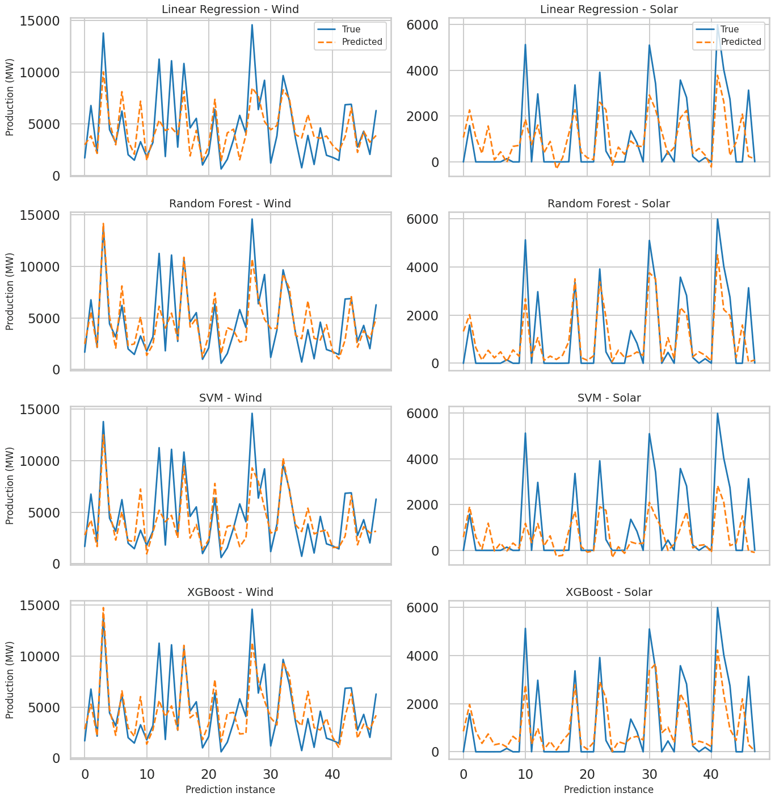

# DATA 228 - Big Data Technologies

Solar and Wind Energy production using weather data

## Overview

This project builds and evaluates machine learning models to predict hourly
solar and wind energy production from weather features (OpenWeatherMap) aligned
with France’s energy output data. After rigorous EDA, feature pruning, and
hyperparameter tuning, we compare Linear Regression, SVM, Random Forest, and
XGBoost on RMSE and R². Random Forest and XGBoost deliver the strongest
performance—especially for wind—while solar remains more challenging due to
higher variance and fewer strong predictors. The repo includes reproducible
notebooks for data prep and model training, enabling fast experimentation,
clear baselines, and extensibility to new regions or timelines.

| Model             | Solar RMSE  | Solar R2  | Wind RMSE   | Wind R2   |
| ----------------- | ----------- | --------- | ----------- | --------- |
| Linear Regression | 1258.1893   | 0.353     | 2111.1018   | 0.644     |
| SVM               | 1445.036    | 0.206     | 1926.370    | 0.693     |
| Random Forest     | **1150.23** | **0.498** | **1747.79** | **0.746** |
| XGBoost           | 1196.4296   | 0.414     | 1844.1227   | 0.728     |

## Project files

- `exploring.ipynb` - File for EDA, converts raw data to usable dataset for machine learning
- `model_{type}.ipynb` - Performs training and testing of the problem statement using the specified model
- `./data` - contains original dataset
- `project.zip` - Full project, including presentation and report

## Team members

- Shrey Agarwal [@shr4git](https://github.com/shr4git)
- Ibrahim Khalid [@ibrahimmkhalid](https://github.com/ibrahimmkhalid)
- Anusmriti Sikdar [@anusmriti26](https://github.com/anusmriti26)
- Justin Wang [@judowang](https://github.com/judowang)
